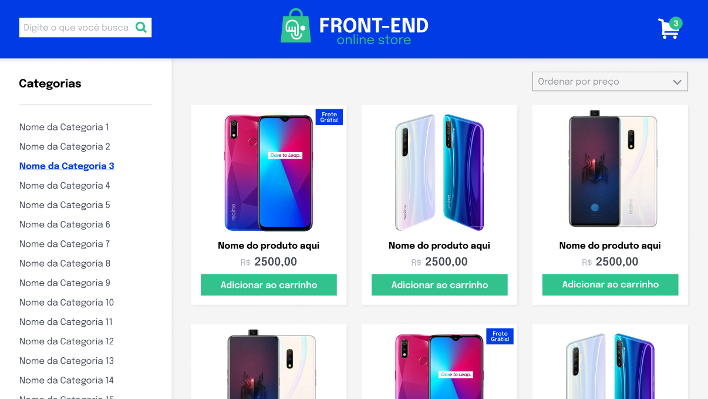
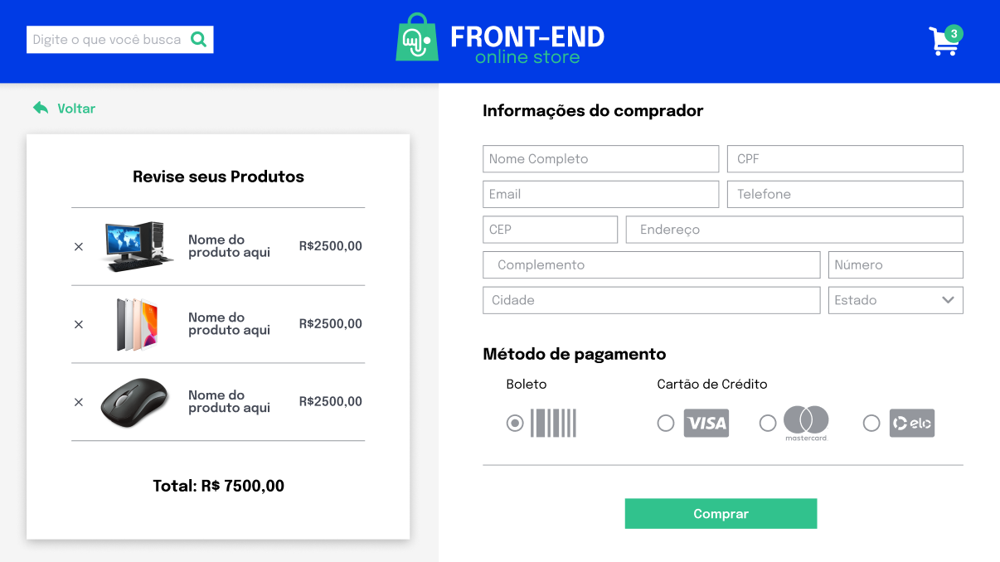

<h1><strong>Online Store</strong></h1>

<h2><strong>Descrição</strong></h2>

  Loja online simplificada (sem persistência em banco) desenvolvida em grupo, com foco em metodologias ágeis e consumo da API do Mercado Livre.
  O projeto simula uma experiência de e-commerce em uma versão simplificada, construída por uma equipe de 5 pessoas, guiada por um quadro Kanban, em um fluxo próximo às práticas reais de mercado.

<h2><strong>Funcionalidades</strong></h2>
<ul>
  <li><strong>Busca de produtos</strong> por termo e por categoria, consumindo a API do Mercado Livre.</li>
  <li><strong>Listagem de produtos</strong> com informações essenciais para decisão de compra.</li>
  <li><strong>Carrinho de compras</strong> com incremento e decremento de quantidade por item.</li>
  <li><strong>Remoção de itens</strong> do carrinho e atualização de totais.</li>
  <li><strong>Detalhes do produto</strong>, incluindo avaliações prévias quando disponíveis.</li>
  <li><strong>Criação de avaliações</strong> (simulação de reviews do produto).</li>
  <li><strong>Finalização de compra</strong> simulada, validando o fluxo do usuário.</li>
</ul>

<h2><strong>Tecnologias</strong></h2>
<ul>
  <li align="justify"><a href="https://www.typescriptlang.org/" target="_blank"><strong>TypeScript</strong></a>: Linguagem principal para lógica de negócio e manipulação do DOM.</li>
  <li align="justify"><a href="https://react.dev/" target="_blank"><strong>React</strong></a>: Biblioteca para construção da interface de usuário com componentes reutilizáveis.</li>
  <li align="justify"><a href="https://developer.mozilla.org/pt-BR/docs/Web/CSS" target="_blank"><strong>CSS</strong></a>: Estilização e layout responsivo da aplicação.</li>
  <li align="justify"><a href="https://nodejs.org/" target="_blank"><strong>Node.js</strong></a>: Ambiente de execução JavaScript no servidor para desenvolvimento local.</li>
  <li align="justify"><a href="https://www.mercadolivre.com.br/developers/pt_br/api-docs-pt-br" target="_blank"><strong>API do Mercado Livre</strong></a>: Fonte dos dados dos produtos e funcionalidades de busca.</li>
</ul>

<h2><strong>Demonstração do Projeto</strong></h2>

  
  
   
  <a href="https://williandpg.github.io/online-store/" target="_blank" rel="noopener noreferrer"><strong>Clique aqui para acessar a aplicação online</strong>
  </a>

<h2><strong>Estrutura do Projeto</strong></h2>

A estrutura do projeto é organizada da seguinte forma:

<pre><code>.
├─ public/
├─ assets/            # Images and icons used in the application
├─ src/
│  ├─ components/     # Reusable components
│  ├─ pages/          # Main application pages
│  ├─ services/       # Services for API integration
│  ├─ App.css       
│  ├─ main.tsx        
│  ├─ App.tsx
│  └─ index.css
├─ package.json
├─ package-lock.json
├─ tsconfig.json
├─ index.html
├─ vite.config.ts
└─ README.md
</code></pre>

<h2><strong>Grupo do projeto</strong></h2>
<ul>
  <li>Projeto desenvolvido em grupo durante a formação Full Stack da <strong>Trybe</strong>.</li>
  <li>
    <strong>Equipe:</strong>
    <ul>
      <li>Willian Gonçalves: <a href="https://github.com/williandpg" target="_blank" rel="noopener noreferrer">GitHub</a></li>
      <li>Ana Luiza Suguimoto: <a href="https://github.com/analusuguimoto" target="_blank" rel="noopener noreferrer">GitHub</a></li>
      <li>Filipe Marques Hottis: <a href="https://github.com/FilipeMHottis" target="_blank" rel="noopener noreferrer">GitHub</a></li>
      <li>Sílvia de Morais: <a href="https://github.com/silviarmorais" target="_blank" rel="noopener noreferrer">GitHub</a></li>
      <li>Victor Gomes: <a href="https://github.com/victorgmachado" target="_blank" rel="noopener noreferrer">GitHub</a></li>
    </ul>
  </li>
</ul>

<h2><strong>Contato</strong></h2>

  <strong>Willian Gonçalves</strong> |
  <a href="https://www.linkedin.com/in/williandpg/" target="_blank"><strong>LinkedIn</strong></a> |
  <a href="https://github.com/williandpg" target="_blank"><strong>Github</strong></a> |
  <a href="https://williandpg.github.io/" target="_blank"><strong>Portfólio</strong></a> |
  <a href="mailto:goncalves.wdp@outlook.com" target="_blank"><strong>Email</strong></a>

<h2><strong>Créditos</strong></h2>

  Projeto desenvolvido em grupo durante a formação Full Stack da Trybe, com foco em metodologias ágeis e consumo da API do Mercado Livre.

  
<strong>English version</strong>

  <h1><strong>Online Store</strong></h1>
  

    Simplified online store (without database persistence) developed in a group, focusing on agile methodologies and consuming the Mercado Livre API.
    The project simulates an e-commerce experience in a simplified version, built by a team of 5 people, guided by a Kanban board, in a flow close to real market practices.
  

  <h2><strong>Features</strong></h2>
  <ul>
    <li><strong>Product search</strong> by term and category, consuming the Mercado Livre API.</li>
    <li><strong>Product listing</strong> with essential information for purchase decision.</li>
    <li><strong>Shopping cart</strong> with increment and decrement of quantity per item.</li>
    <li><strong>Item removal</strong> from the cart and total updates.</li>
    <li><strong>Product details</strong>, including previous reviews when available.</li>
    <li><strong>Review creation</strong> (product review simulation).</li>
    <li><strong>Simulated checkout</strong>, validating the user flow.</li>
  </ul>

  <h2><strong>Technologies</strong></h2>
  <ul>
    <li align="justify"><a href="https://www.typescriptlang.org/" target="_blank"><strong>TypeScript</strong></a>: Main language for business logic and DOM manipulation.</li>
    <li align="justify"><a href="https://react.dev/" target="_blank"><strong>React</strong></a>: Library for building user interfaces with reusable components.</li>
    <li align="justify"><a href="https://developer.mozilla.org/en-US/docs/Web/CSS" target="_blank"><strong>CSS</strong></a>: Styling and responsive layout of the application.</li>
    <li align="justify"><a href="https://nodejs.org/" target="_blank"><strong>Node.js</strong></a>: JavaScript runtime environment on the server for local development.</li>
    <li align="justify"><a href="https://www.mercadolivre.com.br/developers/en/api-docs-en" target="_blank"><strong>Mercado Livre API</strong></a>: Source of product data and search functionalities.</li>
  </ul>

  <h2><strong>Project Demonstration</strong></h2>
  

    
    
     
    <a href="https://williandpg.github.io/online-store/" target="_blank" rel="noopener noreferrer"><strong>Click here to access the online application</strong>
    </a>
  

  <h2><strong>Project Structure</strong></h2>
  
The project structure is organized as follows:

  <pre><code>.
  ├─ public/
  ├─ assets/            # Images and icons used in the application
  ├─ src/
  │  ├─ components/     # Reusable components
  │  ├─ pages/          # Main application pages
  │  ├─ services/       # Services for API integration
  │  ├─ App.css       
  │  ├─ main.tsx        
  │  ├─ App.tsx
  │  └─ index.css
  ├─ package.json
  ├─ package-lock.json
  ├─ tsconfig.json
  ├─ index.html
  ├─ vite.config.ts
  └─ README.md
  </code></pre>

  <h2><strong>Project Group</strong></h2>
  <ul>
    <li>Project developed in a group during the Full Stack training at <strong>Trybe</strong>.</li>
    <li>
      <strong>Team:</strong>
      <ul>
      <li>Willian Gonçalves: <a href="https://github.com/williandpg" target="_blank" rel="noopener noreferrer">GitHub</a></li>
      <li>Ana Luiza Suguimoto: <a href="https://github.com/analusuguimoto" target="_blank" rel="noopener noreferrer">GitHub</a></li>
      <li>Filipe Marques Hottis: <a href="https://github.com/FilipeMHottis" target="_blank" rel="noopener noreferrer">GitHub</a></li>
      <li>Sílvia de Morais: <a href="https://github.com/silviarmorais" target="_blank" rel="noopener noreferrer">GitHub</a></li>
      <li>Victor Gomes: <a href="https://github.com/victorgmachado" target="_blank" rel="noopener noreferrer">GitHub</a></li>
    </li>
  </ul>

  <h2><strong>Contact</strong></h2>
  

    <strong>Willian Gonçalves</strong> |
    <a href="https://www.linkedin.com/in/williandpg/" target="_blank"><strong>LinkedIn</strong></a> |
    <a href="https://github.com/williandpg" target="_blank"><strong>Github</strong></a> |
    <a href="https://williandpg.github.io/" target="_blank"><strong>Portfolio</strong></a> |
    <a href="mailto:goncalves.wdp@outlook.com" target="_blank"><strong>Email</strong></a>
  

  <h2><strong>Credits</strong></h2>
  

    Project developed in a group during the Full Stack training at Trybe, focusing on agile methodologies and consuming the Mercado Livre API.
  

